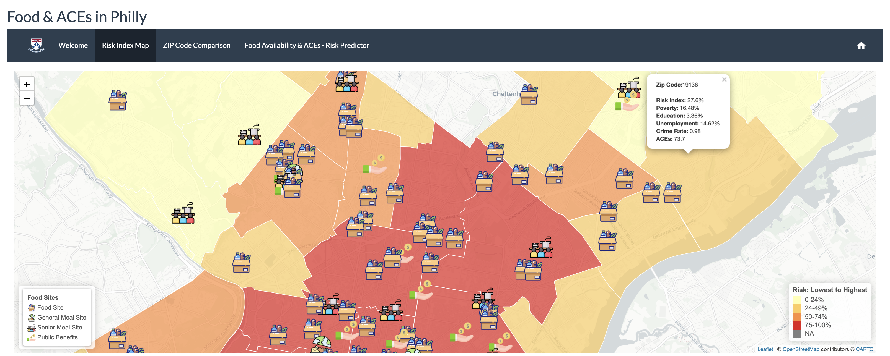

# Food & ACEs in Philly



Interactive Shiny app exploring the relationship between free Food/meal site access and the Adverse Childhood Experiences (ACEs) Risk Index across Philadelphia ZIP codes.

ACEs are potentially traumatic events occurring before age 18, such as abuse, neglect, or household dysfunction, that research has linked to worse long-term health outcomes. The ACEs data used here comes from the 2016 Philadelphia Expanded ACE Survey, conducted by the Philadelphia Health Management Corporation (PHMC), per [Scattergood's methods documentation](https://www.scattergoodfoundation.org/wp-content/uploads/2019/04/FINAL_PlaceMatters-ChildrensHealth_Methods.pdf).

**Live app:** https://onetwo.shinyapps.io/week_8/

Built as a project at the University of Pennsylvania.

## What it does

- **Risk Index Map**: choropleth of ZIP-code-level Risk Index, click any ZIP for its full Poverty/Education/Unemployment/Crime/ACEs breakdown, with free Food/meal site locations overlaid by category (Food Site, General Meal Site, Senior Meal Site, Public Benefits).
- **ZIP Code Comparison**: pick a ZIP code and a benchmark (or city average) and compare Risk, Poverty, Education, Unemployment, Crime, and ACEs side by side.
- **Food Availability & ACEs, Risk Predictor**: linear regression of Risk Index on Food Site Access, rendered via `stargazer`.

## Data sources

- Free Food and meal site locations: [OpenDataPhilly, Free Food Sites](https://opendataphilly.org/datasets/free-food-sites/), a partnership between Philadelphia's Office of Children and Families and local foodbanks.
- ZIP-code Risk Index (Poverty, Education, Unemployment, Crime, ACEs composite): [Scattergood Foundation, Place Matters](https://www.scattergoodfoundation.org/think/publications/place-matters/).
- ZIP code boundary shapefile (`Zipcodes_Poly/`).

All data used is publicly available.

## Running locally

Requires R with: `tidyverse`, `shinythemes`, `shiny`, `plyr`, `leaflet`, `dplyr`, `survey`, `sf`, `readr`, `stargazer`, `rsconnect`, `shinyjs`, `base64enc`.

```r
shiny::runApp()
```

The app reads `place_data.csv`, `free_meal_sites.csv`, and the `Zipcodes_Poly/` shapefile via relative paths, and pulls icons from `icons/`. All four must sit alongside `app.R` for the map tab to load.

## Limitations

Hours of operation weren't factored into the analysis. Senior/adult meal sites were kept in scope since many children live with grandparents or adult caretakers. Regression results are observational: Food site presence is associated with Risk, not shown to cause it (sites tend to be sited where need already exists).

Of the 46 Philadelphia ZIP codes examined, 42 contain at least one free food or meal site. The four without any, 19118 (Chestnut Hill), 19130 (Fairmount), 19154 (Far Northeast), and 19137 (Bridesburg), rank among the city's lower-Risk areas, consistent with the broader pattern of sites concentrating where need is greatest. With only four ZIP codes lacking a site, there is limited variation to model, so the regression (R-squared = 0.081, p = 0.055) points to a direction rather than a firm effect.

ACEs figures are available for 30 of the 46 ZIP codes; per [PHMC's CHDB survey](https://www.chdbdata.org/about-us/about-sepa-household-survey), the source does not report ACEs for a ZIP code when its survey sample is too small to be reliable, so some ZIP codes show no ACEs value. This differs from the Census-sourced columns (Poverty, Education, Unemployment), which cover every ZIP code, since the American Community Survey estimates each one individually.
